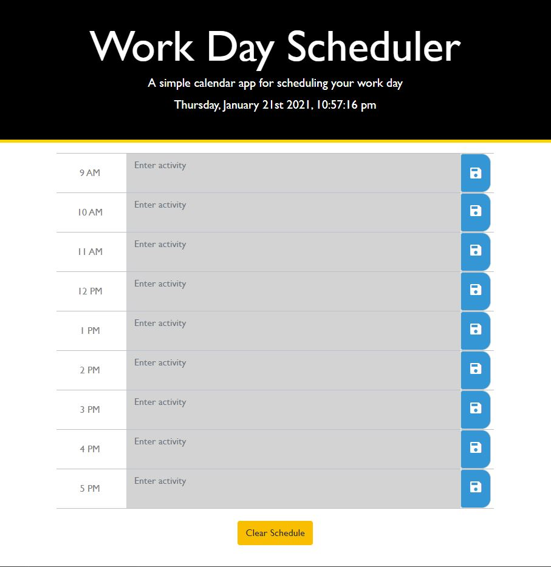

# uofm-bootcamp-homework-05
Work Day Scheduler

## The Repository
This repository ("uofm-bootcamp-homework-05") contains my fifth homework assignment.

## The Assignment
Title: Work Day Scheduler  
Assignment: 5  
Author: Kyle Kleven    
Course: UofM Coding Boot Camp 

### The Purpose
Create a simple calendar application that allows a user to save events for each hour of the day.

### How it Works
* Open the planner
* The current date and time is displayed at the top of the calendar
* Time blocks for standard business hours are displayed beneath
* Each time block is color-coded to indicate whether it is before (grey), or after (green), the current hour (red)
* Click into a time block and enter an event
* Click the save button for that time block
* The text for that event is saved in local storage
* Click the "Clear Activity" button to clear all activity on the page and in storage

### The Mock-up
The following animation demonstrates the application functionality:

## The Deliverable

[Work Day Scheduler] https://kdkleven.github.io/workdayScheduler/index.html
